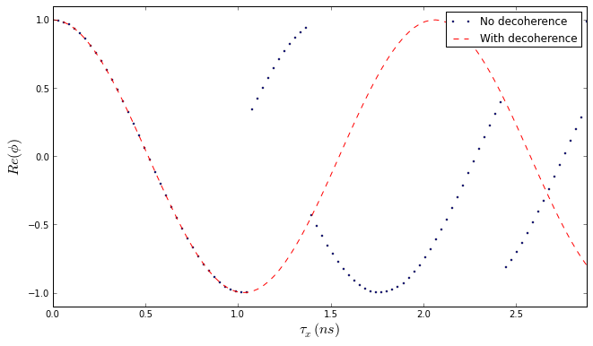

\newpage
\section{Methods}

## Sample preparation.

## Spectroscopy.

## Photon correlations.

## Modelling the experiment.

### Model schematic.

The experiment consists of measuring the correlations between photon pairs. We send a stream of pairs towards a non-polarising
beam splitter, we then choose a polarisation projection using a combination of half and quarter waveplates. The two photons are energetically different and we discriminate the pair using monochromators. Each filtered photon was selected by a polarizing beamsplitter and sent to avalanche photodiodes detectors. Four synchronized sequences of detecor signals were used to build four correlation curves. The experiment schematic is presented in Fig. 1

The simulation attempts to realistically model the single photon correlation curves and polarization resolved correlation curves from a semiconductor quantum dot.

Firstly we build a monte carlo model of the quantum dot emission properties, namely, its emission probabilities related to the excitation laser or voltage, its emission time statistics. For the polarization resolved curves we also take into account the fine structure splitting and decoherence effects.

We then construct the state in the algabraic lab basis and using tensor algebra we propogate the state through the optical bench. The degrees of freedom of this basis are photonic polarization, direction and energy. Polarization is needed since the photons from the quantum dot should be polarization entangled. Direction is needed in order to tell the difference between the output paths of a polarising beam splitter (PBS) and a neutral beam splitter (NBS). Energy is needed to differentiate between the exciton and biexciton state.

The state is then collapsed onto the detectors, we then collect the probabilities of each detector getting a hit. We stochastically choose a single detector, or pair of detectors according to these probabilities. Tagging each detector with a hit time according to the lifetime of the exciton or biexciton we then build up the correlation curves.

\newpage

\begin{figure}[h!]
    \centering
    \includegraphics[width=0.7\textwidth]{images/schematic.png}
    \caption{Schematic of the Hanbury Brown Twiss correlator, the photon pair stream is split energetically and directed towards the detectors. Polarization bases were chosen by changing the waveplates.}
\end{figure}

### Modelling the source.

The photon emission probability of the quantum dot after excitation by a laser or a voltage are given by

$$ p_x(n) = 1 - e^{- n}$$
$$ p_{xx}(n) = 1 - (1+n)e^{- n}$$

Where $p_x$ and $p_{xx}$ are the probabilities of exciton and biexciton emission respectively, $n$ is the mean number of available excitons in the vicinity of the dot. These are assumed, and will naturally give rise to the typical single and cross correlation curves in pulsed excitation mode.

The exciton and biexciton lifetimes are randomly chosen from an exponential decay with characteristic lifetime $\tau_x$ and $\tau_{xx}$ respectively. The characteristic lifetime of the biexciton is typically around half that of the exciton. It is made sure in the simulation that the specific biexciton emission lifetime is always shorter than that of the exciton.

In the polarization resolved case a biphoton state is emitted. This is represented by

$$\ \left|\psi\right\rangle = \left|H_xH_{xx}\right\rangle + e^{i S \tau/\hbar}\left|V_xV_{xx}\right\rangle$$

The phase term is given by $e^{i S \tau/\hbar}$ where $S$ is the fine structure splitting and $\tau$ is the time between the biexciton and exciton emission. In the perfect case of no fine structure splitting the phase term will always be 1.

Decoherence must also be taken into account, this is a process whereby the phase term changes randomly. Here it is phenominalogically chatagorized by a characteristic cross decoherence time of $\tau_{HV}$. It is reported that this time $\tau_{HV}$ is typically longer that the exciton lifetime, implying that physically quantum dots have a coherence term of $>0.7$.

### Modelling the optical bench.

To create the mathematical lab basis we consider three degrees of freedom: polarisation, direction and energy.

The polarisation basis is given by:

$$\hat{h} = \begin{pmatrix}1\\0\end{pmatrix}, \hat{v} = \begin{pmatrix}0\\1\end{pmatrix}$$

The direction basis is given by:

$$\hat{i} = \begin{pmatrix}1\\0\end{pmatrix}, \hat{j} = \begin{pmatrix}0\\1\end{pmatrix}$$

The energy basis is given by:

$$\hat{e}_x = \begin{pmatrix}1\\0\end{pmatrix}, \hat{e}_{xx} = \begin{pmatrix}0\\1\end{pmatrix}$$

For example, an input photon that is $\hat{h}$ polarized, moving in the x direction and with energy $\hat{e}_x$ is calculated by:

$$\gamma_{eg} = \hat{h} \otimes \hat{i} \otimes \hat{e}_x$$

We use theses basis matrices to chategorise matrix operators for various optical bench apparatus, namely the neutral and polarising beam splitters and monochrometers.
The matrix operators can be found by mapping each of the input states to the output states.

$$M = \sum_{i} \left| in_i \right\rangle \left\langle out_i\right| $$

The input and output states and matrix operators are presented in Appendix A for the neutral and polarising beam splitters and monochrometers.

For the wave plates, the common jones matrices are used.

$$HWP = \begin{pmatrix} \cos{2 \theta} & \sin{2 \theta} \\ \sin{2 \theta} & -\cos{2 \theta} \end{pmatrix}$$

$$QWP = \begin{pmatrix} 1 + i \cos{2 \theta} & i \sin{2 \theta} \\ i \sin{2 \theta} & 1- i \cos{2 \theta} \end{pmatrix}$$

These are then adapted to the lab basis. The adapted matrices are presented in Appendix A.

The detector matrices are simply given by the photonic state that the detector is allowed measure, for example Detector1 in Fig.1 is only allowed measure $\hat{h}$ polarized photons with energy $\hat{e}$ moving in the $\hat{i}$ direction.

$$D1 = \hat{h} \otimes \hat{i} \otimes \hat{e}_x$$
$$D2 = \hat{v} \otimes \hat{i} \otimes \hat{e}_x$$
$$D3 = \hat{h} \otimes \hat{i} \otimes \hat{e}_{xx}$$
$$D4 = \hat{v} \otimes \hat{j} \otimes \hat{e}_{xx}$$

All of the matrices defined here act on a single photon state. In the entangled photon case each of this matrices are modified by the relation

$$M_{e} = M \otimes M$$

The total optical bench operator is then given by

$$L_e = PBS_e \cdot S_e \cdot QWP_e \cdot HWP_e \cdot NBS_e$$

The detector pair matrices are given by

$$D1D3 = D1 \otimes D3$$
$$D1D4 = D1 \otimes D4$$
$$D2D3 = D2 \otimes D3$$
$$D2D4 = D2 \otimes D4$$

We can then find what the probability of a given input state $\left|\psi\right\rangle$ will have of hitting a detector pair $D1D3$ is given by

$$P_{D1D3} = |D1D3^{T} \cdot L \cdot \left|\psi\right\rangle |^2$$

### The simulation algorithm

The simulation starts by generating a photonic state. $$\ \left|\psi\right\rangle = \left|H_xH_{xx}\right\rangle + e^{i S \tau/\hbar}\left|V_xV_{xx}\right\rangle$$
The lifetime generated and the phase calculated, if a decoherence event happens before the lifetime is finished, the phase is shifted by some random amount.

_Fig. 2 Phase as a function of time up to a radiative lifetime of 3ns, with two decoherence events._

The state is the operated on by the lab matrix and the detector pair probabilities are calculated.

A detector pair is randomly chosen according to the probabilities, then each detector is hit with the corresponding exciton or biexciton photon.

The correlations are then built up by correlating the different detector hit times.

\newpage

